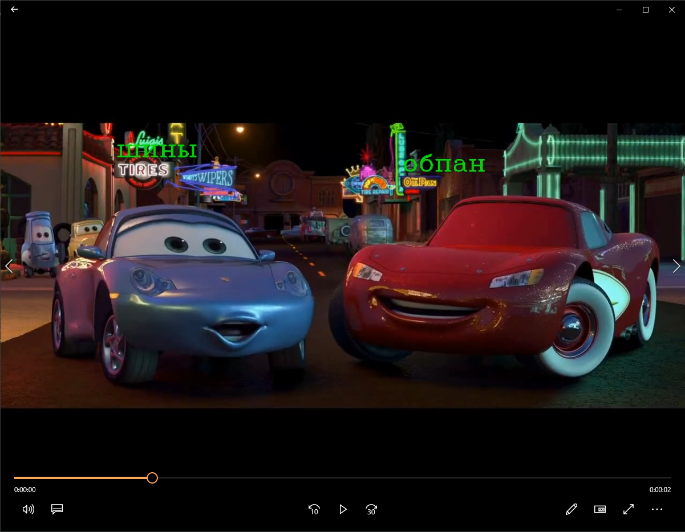

Detection and translation of video text in the background of characters
This repository contains code to detect and translate text into video in the background of characters. It uses the EasyOCR library for text recognition and the Google Translate API for translation (currently I use translate as it is free but it translates worse). The code can read frames from a video file, detect text using EasyOCR, translate the detected text into Russian and save the processed video with the translated text.

In subsequent development, it would be nice to implement an additional method for natural Russian language processing (NLP)

screenshots from the player after processing the video on the free library
[result](img/2024-02-01_13-54-56.png)

Requirements
Python 3.x
OpenCV
PyTesseract
EasyOCR
Matplotlib
NumPy
Google Translate API
Translates 
MoviePy
Installation
Clone the repository:

Plain Text
Copy code
git clone https://github.com/your_username/your_repository.git
cd your_repository
Install the required dependencies using pip:

Plain Text
Copy code
pip install -r requirements.txt
Set up the Google Translate API credentials by following the instructions in the Google Cloud Translation API Documentation.

Replace the video file path in the code with the path to your video file:

In # Initializing EasyOCR
reader = easyocr.Reader(['en'], gpu=False)
Specify the value True if it is possible to process on the GPU

python
Copy code
video = cv2.VideoCapture('path_to_your_video.mp4')
Usage
Run the script using the following command:

Plain Text
Copy code
python main.py
Make sure to replace video_text_detection.py with the name of the script if you rename it.

Output
The script will process each frame of the video, detect text using EasyOCR, translate the detected text to Russian, and save the processed video as final_video.mp4 in the specified output directory.

